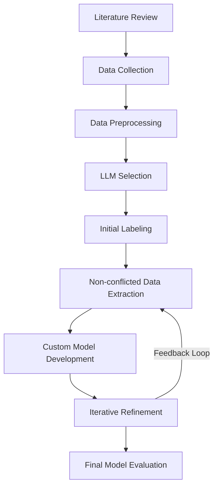
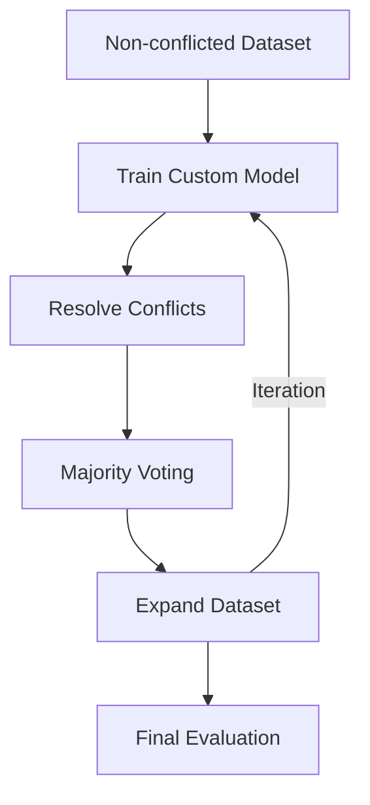

# Sentiment Analysis in Hinglish Using LLMs

## Project Overview

This project aims to develop a robust sentiment analysis model for Hinglish, a code-mixed language combining Hindi and English. By leveraging ensemble learning techniques and addressing the unique challenges of code-mixed languages, we create a high-quality labeled dataset and a custom model for accurate sentiment prediction.

## Objectives

1. Create a comprehensive labeled dataset of Hinglish sentences for sentiment analysis
2. Leverage pre-trained Language Models (LLMs) for initial data labeling
3. Develop custom learning models for accurate sentiment prediction in Hinglish
4. Implement an iterative refinement process to improve dataset quality and model performance
5. Address linguistic nuances and complexities inherent in code-mixed languages

## Technologies Used

- Python
- Pandas
- Large Language Models (LLMs)
- NumPy
- ML/DL Algorithms
- Web Scraping Tools

## Methodology

Our approach involves the following steps:

1. Literature Review and Data Collection
2. Data Preprocessing and Review
3. LLM Selection and Initial Labeling
4. Non-conflicted Data Extraction
5. Custom Model Development
6. Iterative Refinement
7. Final Model Evaluation

### Workflow Diagram

## Detailed Methodology

### 1. Literature Review and Data Collection
- Conduct thorough research on existing sentiment analysis techniques for code-mixed languages
- Web scrape Hinglish data from various online sources to expand the dataset

### 2. Data Preprocessing and Review
- Clean and preprocess the prepared Hinglish data
- Review the dataset for quality and relevance

### 3. LLM Selection and Initial Labeling
- Identify and select top-performing pre-trained LLMs for sentiment analysis
- Use the selected LLMs to label the Hinglish data into positive, negative, and neutral categories

### 4. Non-conflicted Data Extraction
- Extract data rows where all three LLMs agree on the sentiment label
- Create a high-quality, non-conflicted dataset for model training

### 5. Custom Model Development
- Train multiple custom ML/DL models on the non-conflicted dataset
- Analyze and compare model performances to select the best-performing model

### 6. Iterative Refinement
- Use the best custom model along with the three LLMs to resolve conflicts in the remaining data
- Employ a majority voting system among the four models (3 LLMs + 1 custom model) to label conflicting data
- Iteratively train the custom model on the expanded non-conflicted dataset

### 7. Final Model Evaluation
- Assess the final custom model's accuracy and performance
- Validate the model on a separate test set to ensure generalizability

### Iterative Refinement Process

## Expected Outcomes

By following this methodology, we aim to:

1. Create a high-quality labeled dataset for Hinglish sentiment analysis
2. Develop an accurate custom model capable of handling the complexities of code-mixed languages
3. Continuously improve both the dataset quality and model performance through iterative refinement
4. Address the unique challenges posed by Hinglish in natural language processing tasks

## Conclusion

This project tackles the challenging task of sentiment analysis in Hinglish, a code-mixed language. By combining ensemble learning techniques, iterative refinement, and a focus on creating a high-quality dataset, we aim to develop a robust model that can accurately predict sentiment in Hinglish text. This work has potential applications in social media analysis, customer feedback processing, and other areas where understanding sentiment in code-mixed languages is crucial.
